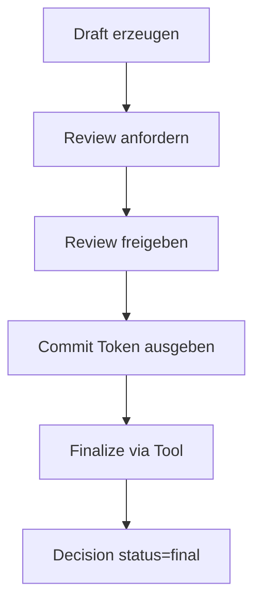

# Entscheidungen (Draft → Review → Commit → Final)

Entscheidungen sind formale Objekte mit Draft/Final-Status. FINAL wird nur durch den Review- und Commit-Flow erzeugt.



## Feldstruktur

META:
- id, projectId (required), clientId?, title, owner, ownerRole?, status, createdAt, updatedAt

INTERNAL:
- assumptions[], derivation, alternatives[], risks[]

CLIENT:
- clientContext, commsContext, clientImplications

OUTCOME:
- goal, successCriteria[], nextSteps[], reviewAt?

GOVERNANCE:
- reviewId? (Draft optional), reviewId (Final required)
- draftId? (optional, bei finalize-from-draft)

## API (MVP)

- POST `/projects/:projectId/decisions/draft`
  - Erstellt Draft Decision, status=draft
- GET `/projects/:projectId/decisions`
  - Listet Draft + Final, neueste zuerst
- GET `/decisions/:id`
  - Lädt einzelne Decision

Hinweis: Es gibt **keinen** API-Endpunkt zum Finalisieren. Finalisierung erfolgt ausschließlich über Tool + Commit-Token.

## Tools (Agent Runtime)

- `tool.decisions.createDraft`
  - Erstellt Draft Decision in der DB
- `tool.decisions.finalizeFromDraft`
  - Finalisiert Draft nach Review/Commit

## Manuelle Tests (curl)

1) Draft erstellen:
```
curl -X POST http://localhost:4000/projects/proj_123/decisions/draft \
  -H "Content-Type: application/json" \
  -d '{
    "title": "Go/No-Go für Pilot",
    "owner": "Max Mustermann",
    "assumptions": ["Datenzugang in 2 Wochen"],
    "alternatives": ["Pilot verschieben"],
    "risks": ["Lieferverzug"],
    "successCriteria": ["Zeitplan eingehalten"],
    "nextSteps": ["Stakeholder informieren"]
  }'
```

2) Drafts listen:
```
curl http://localhost:4000/projects/proj_123/decisions
```

3) Einzelne Decision laden:
```
curl http://localhost:4000/decisions/dec_123
```

4) Review freigeben (Commit Token erhalten):
```
curl -X POST http://localhost:4000/reviews/rev_123/approve \
  -H "Content-Type: application/json" \
  -d '{ "reviewerUserId": "user_1" }'
```

5) Finalisierung via Agent-Execute (Commit-Run):
```
curl -X POST http://localhost:4000/agents/execute \
  -H "Content-Type: application/json" \
  -d '{
    "agentId": "agent_project_v1",
    "userId": "user_1",
    "projectId": "proj_123",
    "userMessage": "Finalize decision",
    "intendedAction": {
      "permission": "decision.create",
      "toolCalls": [
        {
          "tool": "tool.decisions.finalizeFromDraft",
          "input": { "draftId": "dec_123" }
        }
      ],
      "reviewCommit": { "reviewId": "rev_123", "commitToken": "TOKEN_FROM_APPROVAL" }
    }
  }'
```

